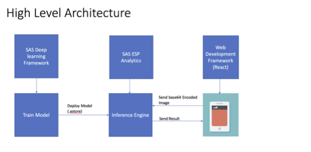

# Image Classification app developed using React Material UI

## Features
- Application should be accessed via SSL end point for camera to work from mobile devices
- Captures and sends Image in base64 encoding using Back Camera
- A docker container for production build (not ready yet)

## Available Scripts

In the project directory, you can run:

### `npm start`

Runs the app in the development mode. 
Open [http://localhost:3000](http://localhost:3000) to view it in the browser.

The page will reload if you make edits. 
You will also see any lint errors in the console.

### `npm run build`

Builds the app for production to the `build` folder. 
It correctly bundles React in production mode and optimizes the build for the best performance.

The build is minified and the filenames include the hashes. 
Your app is ready to be deployed!

See the section about [deployment](https://facebook.github.io/create-react-app/docs/deployment) for more information.

### Docker (work in progress)

This project works in a docker container as well

First run:
`docker build . -t sas_imageai`

Then:
`docker run -p 3000:3000 sas_imageai`
